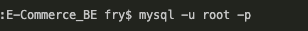
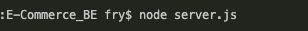

---

# e-Commerce (Backend)

## Description

Internet retail, also known as e-commerce, is the largest sector of the electronics industry, generating an estimated $29 trillion in 2019. E-commerce platforms like Shopify and WooCommerce provide a suite of services to businesses of all sizes. Due to their prevalence, understanding the fundamental architecture of these platforms will benefit you as a full-stack web developer.

The task is to build the back end for an e-commerce site by configuring a working Express.js API to use Sequelize to interact with a MySQL database.

This application won’t be deployed, so please find a walkthrough video that demonstrates its functionality within the README, under the heading Usage.

---

## Table of Contents

[Installation](https://github.com/FryGit87/E-Commerce_BE#installation)

[Usage](https://github.com/FryGit87/E-Commerce_BE#usage)

[Contributing](https://github.com/FryGit87/E-Commerce_BE#contributors)

[Tests](https://github.com/FryGit87/E-Commerce_BE#tests)

[License](https://github.com/FryGit87/E-Commerce_BE#license)

[Questions](https://github.com/FryGit87/E-Commerce_BE#questions)

---

## Installation

To install follow the following instructions:

Clone the repository to your desired location.

Use :

```
git clone git@github.com:FryGit87/E-Commerce_BE
```

Install required dependencies

```
npm install
```

Open intergrated terminal in the main directory then follow the following commands:

Run mySQL:



Run schema, Create Database:


Populate database:


Start the local server:



## Usage

For link to video [Click here!](https://drive.google.com/file/d/1xbLFSyQrbEgBHYwUSR29_JS5zpAUyOE8/view?usp=sharing)
or
See instructional video below:

---

## Contributors

The following users contributed to this project:

Kym Reilly

Any interest in contributing, Fork the repository and create a new 'self-named' branch. Use commit messages to give significant detail on work being pushed. Follow this up with a pull request to the main branch explaining what and why it is to be added.

---

## Tests

No current test implemented for this application but can be arranged if necessary.

---

## License

This project is covered under the mit license.

To read more about it, [click here](https://choosealicense.com/licenses/mit).

---

## Questions

For any questions regarding the project, contact can be made through the following links.

Github: [FryGit87](https://github.com/FryGit87)

Email: [Email Me](kymreilly.87@gmail.com)
